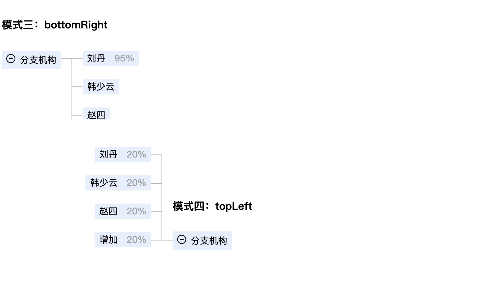

# cr-mindTree

react component

## Example
 

## Usage

```jsx
cnpm install --save cr-mindtree
```

```js
import MindTree from 'cr-mindtree'
import 'cr-mindtree/assets/index.css'
// 注意在使用的时候不能忘记引入css

<MindTree title='分支机构' bgColor='#e4effc'
  tree={[{
    name: 'leaf-on0',
    value: '001',
    accessory: '75%',
  }, {
    name: 'leaf-two',
    value: '002',
    accessory: '25%',
  }]}
  mode='bottomCenter'
/>
```

## 注意
如果使用了cssModule，作为样式的使用方式，在引入css时应特别注意
以And Design Pro使用为例，在对应的页面less中引入css。注意包名前面的波浪线
```less
@import '~cr-mindtree/assets/index.css';
```
## API
name | type | description
-----|------|------------
title|string|组件标题
tree|array|传入组件树数据，类似[{name: 'leaf-one', value: '001'}, {name: 'leaf-two', value: '002'}]
bgColor|string|组件背景颜色
mode   |string|组件展开的方式（'bottomCenter', 'topRight', 'topLeft', 'bottomLeft', 'bottomRight'）
treeChange|func|组件展开收起 function(val) {}; 组件展开val为true,收起为false
leafClick|func|点击组件叶子事件 function(event, val) {}; val为叶子数据
treeBoxWidth|number|组件树叶子部分的宽度，一般不需要设置，默认值为300
className|string|为组建增加className
hoverBgColor|string|组件枝叶及标题hover背景颜色
## Development

```
cnpm install
npm start
```

## Example

http://localhost:8019/examples/testOne.html

## Test
```js
npm test
```


## License

cr-mindTree is released under the MIT license.
